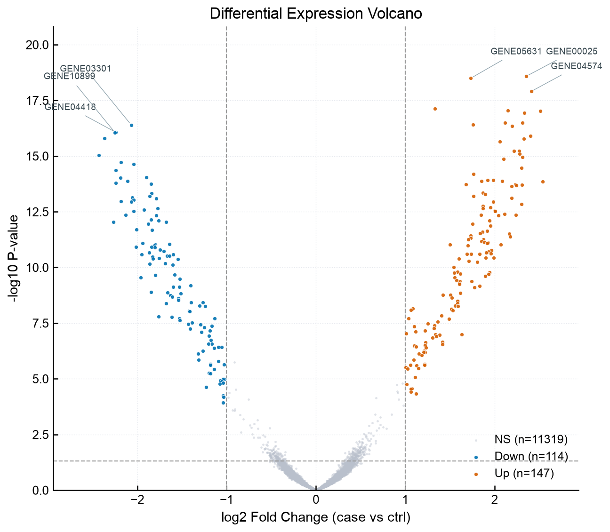
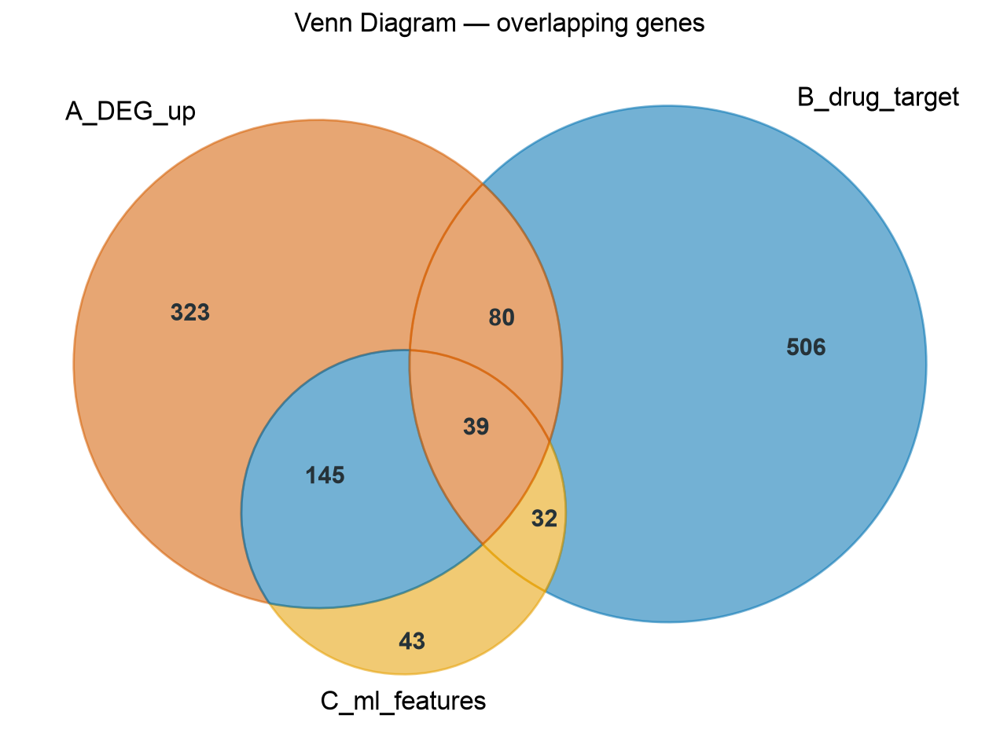
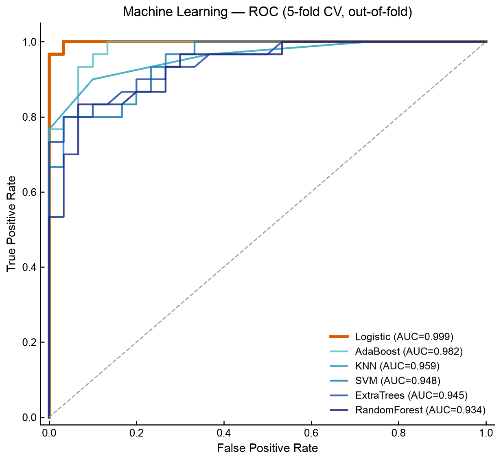
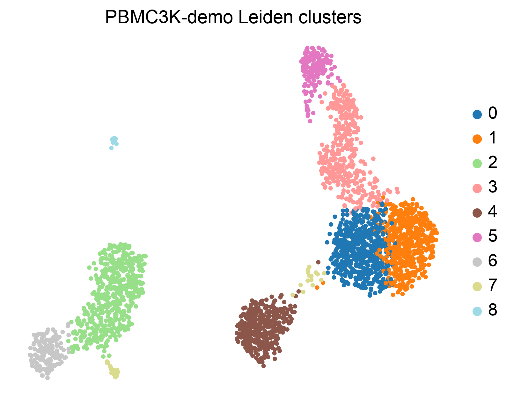
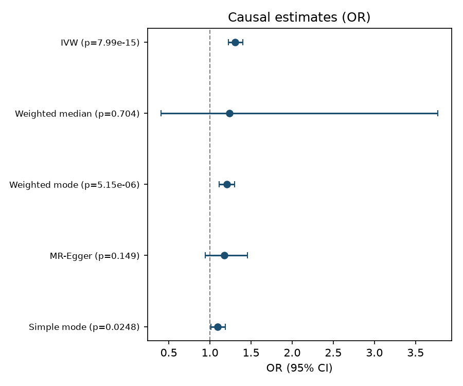

# LKFlow2 Free-Basic（免费开源版）

> **经典转录组（差异/交集/机器学习）+ 单细胞 + 空间转录组 + 孟德尔随机化 —— 零代码生信分析 Skill**
> 来自 [LKFlow2](https://github.com/LK-Studio1128/LKFlow2) 官方：把**模块 1~10 中可离线复现的基础能力**免费开源给大家，**自动装依赖、自动下演示数据、一键出图出表**。

<p>


</p>

---

## 这是什么？

| 模块组 | 命令 | 免费版能做什么（一条命令） | 出什么 |
|---|---|---|---|
| 🧪 **差异表达 DEGs**（对应完整版 2.1） | `deg --demo` | 病例 vs 对照 表达矩阵 → Welch t + BH-FDR + log2FC | 火山图 / Top DEG 热图 / 全基因表 CSV + 报告 |
| 🔁 **多集合交集 VENN**（对应完整版 4.x） | `venn --demo` | 2~3 个基因列表 → 韦恩图 + 区域基因明细 + **核心交集 interGenes.List.txt**（与完整版同格式） | 韦恩图（2/3 集合） + 区域表 + 核心交集 |
| 🤖 **机器学习特征筛选**（对应完整版 6.x） | `ml --demo` | 表达矩阵+分组 → ANOVA 预筛 → **8 分类器 × 5 折 CV ROC-AUC** + RF 特征重要性 | Top6 ROC / AUC 条形 / RF Top20 基因 + 模型评分表 |
| 🧬 **单细胞 scRNA-seq**（对应完整版 8.x 基础） | `scrna --demo` | 10x/H5/H5AD 读取 → QC → 归一化 → PCA → Leiden → UMAP/tSNE → marker | UMAP / tSNE / QC 小提琴 / DotPlot / TopMarker 热图 + 表 + 报告 |
| 🗺️ **空间转录组**（对应完整版 9.x 基础） | `spatial --demo` | Visium → QC → 聚类 → UMAP + **空间定位图** | 空间散点聚类图 / marker DotPlot + CSV + 报告 |
| 🧬 **孟德尔随机化 MR**（对应完整版 10.x 基础） | `mr --demo` | 暴露 vs 结局 GWAS → 对齐 → **5 法因果估计** → 敏感性 | 散点 / 森林 / 漏斗 / 留一森林图 + 5 表 + 报告 |

无需写 R/Python 代码，无需预装任何分析包——`install` 会自动创建虚拟环境并安装依赖。
提供 `--demo` 演示数据（单细胞自动下载 PBMC 3K；其它模块内置合成数据），**几分钟内看到完整结果**。

> 📺 **视频演示**：B 站 / 抖音 / 小红书 / 公众号 搜索「**罗柯生信**」 · 🌍 官网 [lkstudio.org](https://lkstudio.org)

> ⚠️ **版本定位说明**：本仓库是 LKFlow2 的**免费开源体验版**。覆盖完整软件 1~10 大模块中**可纯 Python 离线复现**的基础分析闭环，约占完整软件 36% 的常用分析路径；剩余数据库/在线 API/全基因组批量等功能请用 LKFlow2 完整软件（见文末「完整版 LKFlow2」）。

---

## 快速开始（3 步）

**环境要求**：Python ≥ 3.9（推荐 3.10+）；Windows / macOS / Linux 均可；无需预装 R 或任何分析包。

```bash
# ① 克隆
git clone https://github.com/LK-Studio1128/LKFlow2-Free-Basic.git
cd LKFlow2-Free-Basic

# ② 安装依赖（自动创建虚拟环境 lkflow_env/）
python3 scripts/lkflow_free.py install

# ③ 一键体验（自动下载/生成演示数据，几分钟出全部结果）
python3 scripts/lkflow_free.py all --demo
```

也可以按模块单独跑：

```bash
# 经典转录组（对应完整版 1~7 中的核心可离线模块）
python3 scripts/lkflow_free.py deg   --demo
python3 scripts/lkflow_free.py venn  --demo
python3 scripts/lkflow_free.py ml    --demo

# 三大组学（对应完整版 8/9/10 基础能力）
python3 scripts/lkflow_free.py scrna --demo
python3 scripts/lkflow_free.py spatial --demo
python3 scripts/lkflow_free.py mr-demo-data --out ./demo_mr
python3 scripts/lkflow_free.py mr --exposure ./demo_mr/exposure.csv --outcome ./demo_mr/outcome.csv
```

**用自己的数据？** 把 `--demo` 换成对应的输入参数：

```bash
# 差异 DEG：表达矩阵 CSV（行=基因 列=样本） + 分组表（sample, group）
python3 scripts/lkflow_free.py deg --expr expression.csv --group group.csv

# 韦恩 VENN：2~3 个基因列表文件
python3 scripts/lkflow_free.py venn --files A.txt B.txt C.txt --names "DEG_up" "drug_target" "ml_features"

# 机器学习 ML：同 deg 输入格式
python3 scripts/lkflow_free.py ml --expr expression.csv --group group.csv --n-keep 100

# 单细胞：支持 10x 目录 / .h5 / .h5ad / mtx / csv
python3 scripts/lkflow_free.py scrna --input /path/to/10x --sample-name 我的样本

# 空间：支持 10x Visium spaceranger 输出目录（含 filtered_feature_bc_matrix.h5 与 spatial/）或 .h5ad
python3 scripts/lkflow_free.py spatial --input /path/to/visium/outs

# MR：暴露/结局各一个 CSV（列: SNP,effect_allele,other_allele,eaf,beta,se,pval）
python3 scripts/lkflow_free.py mr --exposure exp.csv --outcome out.csv \
    --exposure-name BMI --outcome-name 冠心病
```

结果统一输出到 `lkflow_out/` 下（图 PNG+PDF、表 CSV、汇总 `summary_report.md`）。

---

## 流程与原理（每个模块做了什么）

### 🧪 差异表达 DEGs（对应完整版 2.1 基础版）

```
输入(demo/自有) → 读取 → 病例组 vs 对照组 (Welch t 检验 + BH-FDR + log2FC)
→ 火山图（up/down 着色） + Top DEG z-score 热图 + 全基因检验结果表 + 报告
```

### 🔁 多集合交集 VENN（对应完整版 4.x 基础版）

```
2~3 个基因列表 (txt/csv) → 容忍表头/空行/大小写归一 → venn2/venn3
→ 各区域基因明细 CSV + 核心交集 interGenes.List.txt（与完整版 4.x 同名） + 报告
```

### 🤖 机器学习特征筛选（对应完整版 6.x 基础版）

```
表达矩阵 + 分组 → ANOVA F 预筛 top150 特征 → 8 种分类器
（Logistic / RandomForest / ExtraTrees / SVM / KNN / GradientBoosting / AdaBoost / NaiveBayes）
× 5 折交叉验证 → 平均 ROC-AUC 排序 → Top6 ROC 曲线 + AUC 条形图
+ 随机森林特征重要性 Top20 + 模型评分表 + 报告
```

### 🧬 单细胞（对应完整版第 8 章「8.1 预处理流水线」的基础子集）

```
输入(demo/自有) → 质控(基因数≥200、线粒体≤20%) → Normalize+log1p
→ 高变基因 2000 → PCA → 近邻图 → Leiden 聚类 → UMAP/tSNE
→ 每群 Wilcoxon marker → QC图/聚类图/DotPlot/热图/占比图 + marker表 + 报告
```

### 🗺️ 空间转录组（对应完整版第 9 章「9.1 空间预处理」的基础子集）

```
Visium 加载 → QC → Normalize+log1p → 高变基因 → PCA → Leiden 聚类
→ UMAP + Spatial 空间定位图（每个 spot 按聚类着色）→ marker + 报告
```

### 🧬 孟德尔随机化（对应完整版第 10 章「10.1 MR 标准分析」的核心方法集）

```
暴露 SNP 表 + 结局 SNP 表 → harmonise 等位基因对齐 → 5 法因果估计
（IVW 固定/随机效应、MR-Egger、加权中位数、加权众数、简单众数）
→ 异质性 Cochran's Q + 多效性 Egger 截距 → 留一法 → 4 图 5 表 + 报告
```

---

## 经典生信三件套串联（差异 → 交集 → 机器学习）

免费版最完整的"经典生信分析"主线——**不依赖任何外部数据库即可串成完整论文级流程**：

```bash
# 1) 先做差异分析，找出 case vs control 显著基因
python3 scripts/lkflow_free.py deg --demo --out ./run/deg

# 2) 把差异基因 与 药物靶点 / ML 特征 做交集（拿到核心 hub 基因）
python3 scripts/lkflow_free.py venn --files ./run/deg/DEG_up.txt drugs.txt ml.txt --out ./run/venn

# 3) 用机器学习在差异基因上训练分类模型，挑核心基因
python3 scripts/lkflow_free.py ml --expr ./run/deg/expression_matrix.csv --group ./run/deg/group_info.csv --n-keep 100 --out ./run/ml
```

这正是 LKFlow 1.x 主线「下载 → 差异 → 交集 → 机器学习 → 验证」中的三步，免费开源版完全覆盖。

---

## 示例结果

> 以下为**本仓库脚本**运行 `python3 scripts/lkflow_free.py all --demo` 真实产出的图（`examples/free_*`），每张都可用一条命令复现。

### 免费版真实输出（一条命令即可复现）

| 差异 DEG 火山图 | 韦恩图（三集合） | 机器学习 ROC | 单细胞 UMAP | MR 森林图 |
|---|---|---|---|---|
|  |  |  |  |  |

### 完整版 LKFlow2 软件输出

完整版在同类输入下可产出更高级的图表（官网 [lkstudio.org](https://lkstudio.org) 与 [LKFlow2 releases](https://github.com/LK-Studio1128/LKFlow2/releases) 页可见结果展示）：

- **单细胞**：CellChat / NicheNet 细胞通讯网络图集（45+ 张）、Monocle 轨迹、inferCNV/CopyKAT 恶性细胞热图、虚拟敲除与药物预测图
- **空间**：RCTD/Cell2location 细胞类型空间分布图（10+ 张）、SpaGCN/BANKSY 空间域、LISA 热点图、MISTy 建模图
- **MR**：全基因批量森林图、coloc 后验概率图、药物靶点三角验证图 + STROBE-MR 投稿清单

---

## 免费版 vs 完整版 LKFlow2（覆盖矩阵）

| 完整软件模块 | 完整能力 | 免费版覆盖 | 完整版独占 |
|---|---|---|---|
| **1. 数据处理** | GEO 下载、合并批次、ID 转换 | ❌ | ✅ 1.x 全部 |
| **2.1 DEGs** | limma / DESeq2 / 多分组 | ✅ `deg`（Welch t+BH-FDR） | limma 经验贝叶斯 / DESeq2 / 多分组 / 协变量 |
| **2.2 WGCNA** | 加权基因共表达 | ❌ | ✅ 2.2 全套 |
| **3. 网络药理学** | 复方/单体/逆向网药 | ❌ | ✅ 3.x 全部 8 子模块 |
| **4. 交集 VENN** | VENN/VEEN+1/VEEN-Auto | ✅ `venn`（2~3 集合 + interGenes.List） | VENN+1 / VENN-Auto / 4+ 集合 |
| **5.1 PPI / 5.2 GO+KEGG** | STRING 互作 / 富集 | ❌ | ✅ 5.x 全套 |
| **6. 机器学习** | 10/127/8/14/207/100 + SHAP | ✅ `ml`（8 分类器 ROC + RF Top20） | 大规模寻优 / Lasso / SHAP / 预后 |
| **7. 验证** | 免疫浸润 / GSEA / KM / GSVA / 药敏 | ⚠️ ROC 已在 ml 中；其他需完整版 | ✅ 7.x 全部 11 子模块 |
| **8. 单细胞** | 36 个子模块 | ✅ `scrna`（QC→聚类→marker 基础） | ✅ 8.x 全部 36 子模块 |
| **9. 空间** | 7 大流水线（域/反卷积/MISTy） | ✅ `spatial`（QC→聚类→空间定位） | ✅ 9.x 全部 7 大流水线 |
| **10. MR** | 6 大板块（MVMR/双向/coloc/药靶） | ✅ `mr`（5 法 + 异质性 + 留一） | ✅ 10.x 全部 6 大板块 |

**结论**：本 Skill 覆盖**经典转录组线（差异/交集/机器学习）三大核心**+ **三大组学基础分析闭环**，**离线 + 零依赖 + MIT 协议**。剩余能力（数据库/在线 API/全基因组批量）请用 LKFlow2 完整软件一键全自动完成。

---

## 完整版 LKFlow2（为什么要关注它？）

完整版把下面这些"进阶需求"全部做成**图形界面里点一点就完成的一键式全自动流程**，适合要发高质量论文、不想在命令行折腾的科研用户：

- **单细胞（41 个功能点）**：GEO 数据下载 → 六法自动细胞注释 → 亚群再聚类 → 细胞周期/干性/签名打分 → Monocle 轨迹 + RNA Velocity → CellChat/NicheNet/MultiNicheNet 通讯 → pySCENIC/GRN/hdWGCNA 调控 → 代谢/CNV 恶性细胞/免疫组库/scATAC → **虚拟基因敲除、CellOracle 扰动预测、scGPT/scPRINT 大模型、CMAP 药物预测** → 流水线编辑器一键编排 → 自动报告 + AI 助手
- **空间转录组（7 大流水线）**：图像分割 → SpaGCN/BANKSY 空间域 → RCTD/CARD/Cell2location 等 10 种反卷积定位细胞类型 → 区域差异/WGCNA/代谢 → Moran's I/LISA 空间统计 → MISTy/空间通讯/邻域
- **孟德尔随机化（6 大板块）**：全基因组批量 MR（可后台 2 小时全量）→ IVW 筛选 → 差异∩MR 交集 → MVMR 多变量 → 双向 MR → coloc 共定位 → pQTL 药物靶点三角验证 → 多效性分层 → **STROBE-MR 20 条投稿清单 + AI 解读**

**获取与了解更多：**
- 📦 软件发布与下载：[github.com/LK-Studio1128/LKFlow2/releases](https://github.com/LK-Studio1128/LKFlow2/releases)
- 📖 使用教程（B 站 / 抖音 / 视频号 搜索「LKFlow2」）
- 📮 商务咨询：GitHub Issues 或发布页联系方式

---

## 🌐 罗柯生信 · 软件全家桶（官网 [lkstudio.org](https://lkstudio.org)）

本 Skill 来自 **罗柯生信（LKStudio）** 旗下全自动科研软件矩阵。除 LKFlow 生信平台外，还有覆盖分子到组学的完整产品线：

| 软件 | 定位 | 核心能力 |
|---|---|---|
| **LKDock v1.0** | 分子对接全自动软件 | 一键查询/下载配体受体、预处理、对接盒子、30 对并发对接、结果分析、3D 图与 PDF 论文报告 |
| **LKDock v2.0** | 虚拟筛选全自动软件 | GPU 对接引擎、虚拟筛选、多肽/小分子/核酸对接、ADME 预测、柔性对接、中药成分查询 |
| **LKDock v3.0** | 蛋白对接全自动软件 | 蛋白-蛋白对接、RNA/DNA 核酸对接、膜对接、口袋自动预测、113 种金属离子对接、100+ 任务并发、全平台 |
| **LKDock v4.0** | 分子动力学模拟全自动软件 | 全自动 MD 模拟、13 种全场景计算体系、34 种学术分析功能模块 |
| **LKFlow** | 一键网络药理学和生信分析软件 | 2.0 版 10 大板块 90 模块：GEO 挖掘 → DEGs/WGCNA → 网络药理学 → 机器学习 → 免疫浸润/生存 → 单细胞/空间/MR 跨组学闭环 |
| **LKDock001** | 批量 PLIP 分析工具 | 蛋白-配体互作（PLIP）批量分析 |

**开源项目**：[LK-UniDock](https://github.com/LK-Studio1128/LK-UniDock)（GPU 分子对接引擎）· [LKina](https://github.com/LK-Studio1128/LKina)（金属/共价对接）· [LKlight](https://github.com/LK-Studio1128/LKlight)（Rust 高性能蛋白对接）

- 🌍 **官网**：[lkstudio.org](https://lkstudio.org)（产品介绍 / 结果展示 / 套餐说明 / 软件下载 / 全套教程）
- 📺 教程：公众号 / 小红书 / B站 / 抖音 搜索「**罗柯生信**」

---

## 常见问题

| 问题 | 回答 |
|---|---|
| 安装很慢 / 超时？ | 首次需下载分析库（约 200MB），请保持网络稳定；国内可先配置 pip 镜像 `pip config set global.index-url https://pypi.tuna.tsinghua.edu.cn/simple` |
| `--demo` 单细胞下载失败？ | pbmc3k 演示数据需联网；离线请用 `--input` 传自己的 10x 数据 |
| 聚类报错找不到 leiden？ | `install` 会自动装聚类后端（leidenalg→python-louvain 依次尝试），仍失败请重跑 `python3 scripts/lkflow_free.py install` |
| 支持哪些数据格式？ | 单细胞：10x 目录 / h5 / h5ad / mtx / csv,txt；空间：Visium 10x 目录 / h5ad；MR：见输入列模板 |
| MR 的 demo 数据是真实的吗？ | 为方便体验内置**合成数据**（自洽因果结构），请勿用于论文；真实数据流程完全一致 |
| 结果可以直接用于论文吗？ | 免费版图表可用于学习与基础图表；投稿建议使用完整版全套图表与报告规范（STROBE-MR 等） |

---

## 许可证与致谢

- 本仓库代码：MIT License，自由使用、修改与分发（注明出处即可）。
- 内置分析方法引用：Seurat/scanpy 生态、CellChat、Monocle、TwoSampleMR 等开源工作——致谢所有作者。
- 本仓库与 LKFlow2 完整软件版权归属各自作者；完整软件为闭源发行，Free-Basic 与其相互独立。

**如果觉得有用，欢迎 ⭐ Star 并转发给需要的同学，让更多人少走弯路！**
